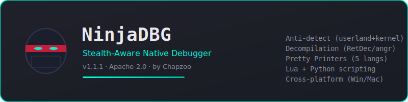

<div align="center">



[](https://github.com/ChapzoMods/NinjaDBG/releases/latest)
[](https://opensource.org/licenses/Apache-2.0)
[](https://github.com/ChapzoMods/NinjaDBG)
[](https://isocpp.org/)

**Version 1.1.1** | Open Source (Apache-2.0) | Created by **Chapzoo**

[Live Demo & Docs](https://chapzomods.github.io/NinjaDBG/) | [Download](https://github.com/ChapzoMods/NinjaDBG/releases/latest) | [Star](https://github.com/ChapzoMods/NinjaDBG/stargazers)

</div>

---

## Overview

NinjaDBG is an open-source (Apache-2.0) native C++17 debugger for Linux x86-64
with experimental cross-platform support for Windows (PE) and macOS (Mach-O)
binaries. It is engineered around one principle: **silence**. Where conventional
debuggers leave obvious traces (INT3 bytes in `.text`, `TracerPid` set in
`/proc/self/status`, parent process names like `gdb`), NinjaDBG masks, redirects,
or eliminates each signal so the target process believes it is running alone.

### What changed in v1.1.1 (hotfix)

- **GUI removed.** NinjaDBG is now CLI-only. The headless CLI exposes the full
  feature set. This eliminates the Cairo/Pango/X11 build dependencies and
  removes ~2,000 lines of experimental GUI code that was never production-ready.
- **libninjastealth.so completely rewritten.** The preload payload now hooks
  `open`, `open64`, `openat`, `read`, `pread`, `readv`, `fopen`, `ptrace`, and
  `prctl`. It masks `TracerPid` in `/proc/self/status`, `ptrace_stop` in
  `/proc/self/wchan`, the syscall field in `/proc/self/syscall`, the state char
  in `/proc/self/stat`, the comm field in `/proc/self/comm`, and filters
  `ninjadb`/`ninjastealth` lines from `/proc/self/maps`. All buffer operations
  use `memmem`/`memchr` instead of `strstr`/`strchr` to avoid over-reads on
  non-NUL-terminated procfs data.
- **10 bug fixes** from code review (see [Changelog](#changelog) below).
- **License inconsistency fixed.** The CLI banner, EULA text, and all source
  headers now consistently say "Apache-2.0". A stale "MIT License" reference in
  `WelcomeScreen.cpp` was corrected.
- **No emojis in documentation.** README and landing page now use SVG images
  and plain text for a professional appearance.

---

## Features

### Debugging engine

| Capability | Status | Notes |
|---|---|---|
| Attach to running process by PID | Yes | `ptrace(PTRACE_ATTACH)` |
| Launch + trace new process | Yes | `PTRACE_TRACEME` + `execv` |
| Detach / kill | Yes | `PTRACE_DETACH` / `SIGKILL` |
| Single-step, step-over, step-out | Yes | Instruction-level granularity |
| Continue / pause | Yes | `PTRACE_CONT`, `SIGSTOP` |
| Software breakpoints (INT3) | Yes | 0xCC patching, original byte preserved |
| Hardware breakpoints (DR0-DR3) | Yes | No `0xCC` in target `.text` |
| Conditional breakpoints | Yes (fixed in v1.1.1) | `"rax == 0x10"` syntax; condition now actually checked |
| Temporary breakpoints | Yes (fixed in v1.1.1) | Auto-removed after first hit |
| Watchpoints (memory access) | Yes | DR0-DR3 with W / RW / X |
| Read/write registers + memory | Yes | `process_vm_readv`/`writev` (stealth) |
| Backtrace (RBP chain walk) | Yes | Symbol resolution from `/proc/<pid>/maps` |
| Syscall stepping | Yes | `PTRACE_SYSCALL`, entry vs exit detection |
| Full x86-64 disassembler | Yes | Standalone module; ALU size/direction fixed in v1.1.1 |
| Interactive TUI memory editor | Yes | VT100 raw-mode; hex+ASCII, seek, search, follow-ptr |
| Lua + Python scripting | Yes | JSON-RPC subprocess bridge; `ndbg` module properly registered |
| Pretty printers (C/C++/Rust/Go/Python) | Yes | Language-aware string and struct printing |
| Native C decompilation | Yes | RetDec (dlopen + subprocess) and angr backends |
| Binary patching | Yes | ELF/PE/Mach-O: NOP, JMP, CALL-to-NOP, rettrue, ASCII |
| Cross-platform | Yes | Linux native; Windows via Wine; macOS via QEMU |

### Stealth subsystem

| Layer | Techniques | Notes |
|---|---|---|
| Userland (8 techniques) | HW breakpoints, `process_vm_readv`, mask `/proc/self/status`, hide mmaps, timing normalization, parent name masquerade, hide from ps, INT3 scan bypass | Always available; `libninjastealth.so` auto-compiled on first run |
| Kernel (8 techniques) | Hide PID from `/proc`, mask wchan, mask syscall, mask comm, suppress SIGCHLD, force dumpable, intercept TRACEME, hide mmaps | Optional LKM (`ninja_stealth.ko`); requires root |

### libninjastealth.so hooks (rewritten in v1.1.1)

| Hook | What it does |
|---|---|
| `open` / `open64` / `openat` | Detects opens of `/proc/self/{status,wchan,syscall,stat,comm,maps}` and tags the fd |
| `read` / `pread` / `readv` | Rewrites buffered reads from tagged fds: `TracerPid: 0`, `wchan: 0`, `syscall: running`, `stat: R`, `comm: kworker/u:1`, maps lines filtered |
| `fopen` | Same tagging as `open` but for stdio |
| `ptrace` | `PTRACE_TRACEME` returns -1/ESRCH (hides that we are tracing) |
| `prctl` | `PR_GET_DUMPABLE` always returns 1 |

All buffer rewriting uses `memmem`/`memchr` (bounded by read count) instead of
`strstr`/`strchr` (which require NUL termination and can over-read procfs data).

---

## Headless CLI

The headless CLI is the only interface (GUI was removed in v1.1.1).

### Launching

```bash
# Interactive REPL (default)
ninjadb

# Batch mode (commands separated by ;)
ninjadb -c "target ./malware; patch nop 0x401000 16; patch save ./patched; quit"

# Skip EULA prompt
ninjadb --no-eula-check
```

### Command reference

| Command | Description |
|---------|-------------|
| `attach <pid>` | Attach to a running process |
| `launch <bin> [args...]` | Launch a new process under the debugger |
| `detach` / `kill` | Detach or kill the target |
| `continue` / `step` / `next` / `finish` | Run control (continue / single-step / step-over / step-out) |
| `syscall-step` | Run until next syscall entry or exit |
| `break <addr> [cond]` | Set a breakpoint, optionally conditional |
| `tbreak <addr>` | Set a temporary breakpoint |
| `watch <addr> [len] [w\|rw\|x]` | Set a watchpoint |
| `delete <id>` | Delete a breakpoint/watchpoint |
| `info <b\|r\|t\|m\|target>` | Show breakpoints/registers/threads/maps/target |
| `x /Nxb <addr>` | Examine N bytes in hex |
| `set <addr> = <byte>...` | Write bytes to memory |
| `disas [addr] [count]` | Full x86-64 disassembly |
| `edit [addr]` | Interactive TUI memory editor |
| `decomp [addr] [max_bytes]` | Native C decompilation via RetDec/angr |
| `decomp file <bin> [addr]` | Decompile whole file or one function |
| `pretty set <lang>` | Set pretty printer language (c/cpp/rust/go/python) |
| `pretty cstring/cpp_string/rust_string/go_string/py_string <addr>` | Print language-specific strings |
| `pretty struct <addr> <desc>` | Parse struct by type descriptor |
| `bt` / `backtrace` | Show call stack |
| `target <binary>` | Load a binary for static patching |
| `patch nop/apply/save/undo` | Binary patching |
| `stealth list/on/off` | Anti-detect technique management |
| `kernel status/load/unload` | Kernel module management |
| `script run lua/python <file>` | Run Lua/Python scripts |
| `help` / `quit` | Help / exit |

---

## Decompilation

NinjaDBG integrates Avast RetDec (native dlopen + subprocess) and angr as
decompilation backends.

```bash
(ninjadb) decomp set angr
(ninjadb) decomp file /tmp/test_factorial 0x401139
Backend: angr  Elapsed: 1896 ms

int factorial(int a0)
{
    return (a0 <= 1 ? 1 : a0 * factorial(a0 - 1));
}
```

---

## Pretty Printers

Language-aware pretty printing for C, C++, Rust, Go, and Python.

```bash
(ninjadb) pretty cpp_string 0x7ffe1000
(std::string) 0x7ffe1000 = "Hello, world!"  (len=13, SSO, data=0x7ffe1010)

(ninjadb) pretty rust_string 0x7ffe2000
(String) 0x7ffe2000 = "Hello, world!"  (len=13, cap=13, ptr=0x55aabbccdd00)

(ninjadb) pretty struct 0x7ffe3000 i32,str,ptr,u64
struct at 0x7ffe3000:
  +0x0   i32  = 42  (0x2a)
  +0x8   ptr  = 0x401234 -> "hello world"
  +0x10  ptr  = 0x7ffe5678
  +0x18  u64  = 139832  (0x22238)
```

---

## Build

### Prerequisites (Debian/Ubuntu)

```bash
sudo apt-get install build-essential pkg-config

# Optional, for full features:
sudo apt-get install wine wine64 qemu-user linux-headers-$(uname -r)
pip3 install angr
sudo apt-get install retdec-dev
```

No more Cairo/Pango/X11 dependencies (GUI was removed in v1.1.1).

### Compile

```bash
cd NinjaDBG
make -j4
```

This produces `build/ninjadb` (the CLI binary) and `build/target_test` (demo target).

---

## Run

```bash
# Interactive CLI (default — no --cli flag needed anymore)
./build/ninjadb

# Batch mode
./build/ninjadb --no-eula-check -c "attach 12345; disas; decomp; quit"
```

---

## Changelog

### v1.1.1 (this release)

**GUI removed:**
- Deleted `MainWindow.cpp`, `MainWindowPanels.cpp`, `MainWindow.h`, `UITheme.h`
- Removed Cairo/Pango/X11 build dependencies from Makefile
- `main.cpp` now defaults to CLI (no `--cli` flag needed)
- Removed GUI references from WelcomeScreen and EULA

**libninjastealth.so rewritten:**
- Added hooks for `open64`, `openat`, `pread`, `readv`, `fopen`, `ptrace`, `prctl`
- Now masks 6 procfs files (was 1): status, wchan, syscall, stat, comm, maps
- All buffer operations use `memmem`/`memchr` (was `strstr`/`strchr` — unsafe on procfs data)
- Added null-check for `dlsym` return values
- Constructor initializes fd tracking table

**Bug fixes (10 fixes from code review):**
1. Disassembler: ALU opcodes (0x00-0x3B) had size and direction bits swapped
2. Disassembler: group 8 (`0F BA`) out-of-bounds read on `g8[]` array
3. Disassembler: segment register array (`sregs[]`) out-of-bounds for reg=6,7
4. DebuggerCore: conditional breakpoints never checked their condition
5. DebuggerCore: temporary breakpoints never auto-removed
6. HeadlessCLI: `finish`/`fo` command was a no-op (empty handler)
7. BinaryPatcher: `JmpAlways` 6-byte patch had wrong displacement sign
8. AntiDetect: `buildPreloadPayload` overwrote hand-maintained `ninjastealth.c`
9. ninjastealth.c: `strstr`/`strchr` buffer over-read on non-NUL-terminated data
10. ScriptEngine: `ndbg.delete(id)` returned "unknown command" (handler missing)

**License fix:**
- WelcomeScreen.cpp header said "MIT License" — changed to "Apache-2.0"
- CLI banner now consistently says "Open Source (Apache-2.0)"

**Documentation:**
- Removed all emojis from README
- Added SVG banner image
- Removed GUI references from README and landing page

### v1.1.0
- Switched from Closed Source to Open Source
- Added Pretty Printers (C/C++/Rust/Go/Python)
- 5 user-reported bug fixes
- 9 HIGH-severity code fixes

### v1.0.0 - v1.0.5
- Initial releases (Closed Source)

---

## Architecture

```
NinjaDBG/
├── Makefile
├── LICENSE                     Apache License 2.0
├── README.md
├── resources/
│   ├── ninja_logo.png
│   ├── ninja_logo.svg
│   └── icons/                  SVG icons (used by landing page)
├── docs/
│   ├── index.html              Landing page (GitHub Pages)
│   └── banner.svg              README banner image
├── include/
│   ├── Types.h
│   ├── DebuggerCore.h          ptrace-based core
│   ├── AntiDetect.h            8 userland stealth techniques
│   ├── KernelStealth.h         8 kernel techniques + LKM
│   ├── BinaryPatcher.h         ELF/PE/Mach-O patcher
│   ├── PlatformAdapters.h      Linux/Windows/macOS adapters
│   ├── Disassembler.h          Standalone x86-64 decoder
│   ├── InteractiveMemoryEditor.h  TUI memory editor
│   ├── ScriptEngine.h          Lua + Python JSON-RPC bridge
│   ├── Decompiler.h            RetDec + angr wrapper
│   ├── PrettyPrinter.h         C/C++/Rust/Go/Python printers
│   ├── HeadlessCLI.h           CLI REPL
│   └── WelcomeScreen.h         Apache-2.0 license flow
├── src/
│   ├── main.cpp                Entry point (CLI-only)
│   ├── DebuggerCore.cpp
│   ├── AntiDetect.cpp
│   ├── KernelStealth.cpp
│   ├── BinaryPatcher.cpp
│   ├── PlatformAdapters.cpp
│   ├── Disassembler.cpp
│   ├── InteractiveMemoryEditor.cpp
│   ├── ScriptEngine.cpp
│   ├── Decompiler.cpp
│   ├── PrettyPrinter.cpp
│   ├── HeadlessCLI.cpp
│   └── WelcomeScreen.cpp
└── scripts/
    ├── target_test.cpp         Demo target
    ├── ninjastealth.c          Preload payload (rewritten in v1.1.1)
    └── ninja_stealth_kmod.c    Generated kernel module source
```

---

## License

Apache License 2.0. See [LICENSE](LICENSE) for the full text.

---

## Author

**Chapzoo** (GitHub: **ChapzoMods**)

---

## Contributing

Contributions are welcome. Fork the repo, create a feature branch, open a Pull
Request. Report bugs via GitHub Issues.

---

<div align="center">

NinjaDBG v1.1.1 | Apache-2.0 | by Chapzoo

Stay stealthy.

</div>
