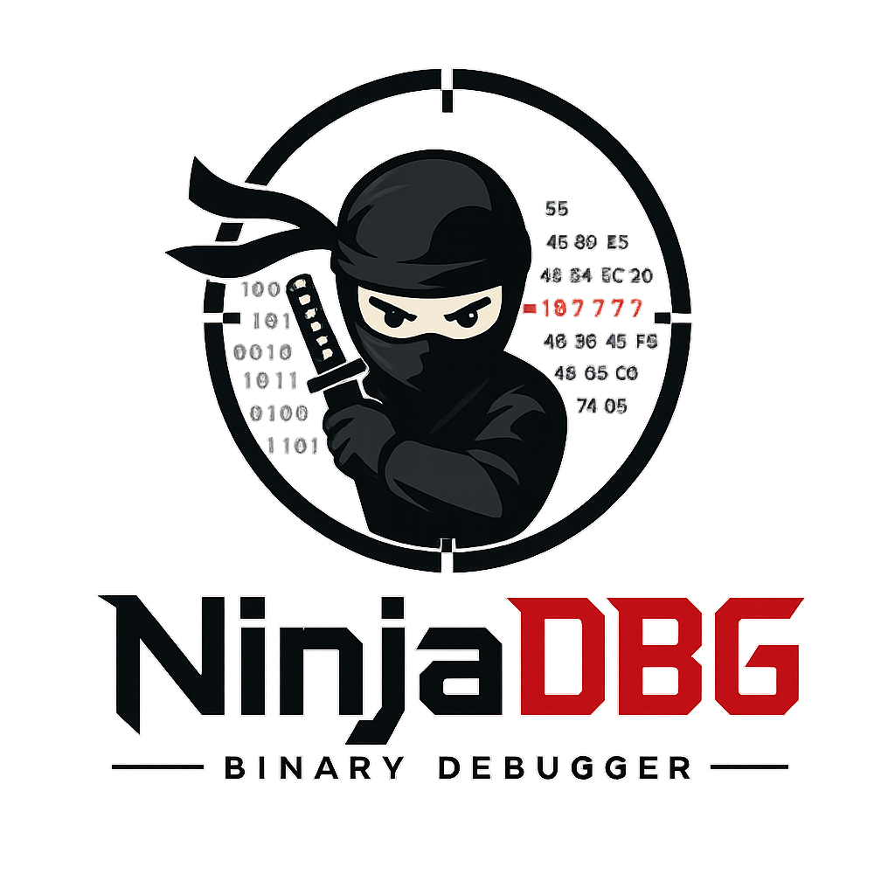

<div align="center">

# 🥷 NinjaDBG



### Stealth-Aware Native Debugger for Linux x86-64<br/>with experimental Windows & macOS support

**Version 1.0.5** · Closed Source · Free · Created by **Chapzoo**

[Features](#-features) · [Headless CLI](#-headless-cli) · [Kernel Stealth](#-kernel-level-stealth) · [Binary Patching](#-binary-patching) · [Cross-Platform](#-cross-platform-debugging) · [License](#-license)

> ⚠️ **The graphical interface is EXPERIMENTAL and still under active development.**
> For production use, prefer the headless CLI (`ninjadb --cli`). The CLI exposes
> the full feature set — kernel stealth, binary patching, conditional breakpoints,
> watchpoints, step-over/step-out, syscall stepping — while the GUI currently
> exposes a subset. See [§ Roadmap](#-roadmap) for what's planned.

</div>

---

## 📖 Overview

**NinjaDBG** is a closed-source, free, native C++17 debugger for Linux x86-64
with experimental cross-platform support for Windows (PE) and macOS (Mach-O)
binaries via Wine and QEMU adapters. It is engineered around one principle:
**silence**. Where conventional debuggers leave obvious traces — INT3 bytes in
`.text`, `TracerPid` set in `/proc/self/status`, parent process names like
`gdb` or `lldb`, kernel-visible `wchan` of `ptrace_stop` — NinjaDBG masks,
redirects, or eliminates each signal so that the target process believes it is
running alone.

It is purpose-built for analysts working against:

- **Packed binaries** (UPX, Themida, VMProtect) that abort when traced
- **Malware loaders** that scan their own `.text` for `0xCC` software breakpoints
- **DRM / license-check routines** that probe `ptrace` state via `/proc/self/wchan` or `/proc/self/syscall`
- **Anti-cheat agents** that enumerate `/proc/<pid>/maps` looking for injected
  preload libraries, or that check parent process names against a denylist

NinjaDBG v1.0.5 adds: a full-featured **headless CLI**, **kernel-level stealth**
(via a loadable kernel module), a **binary patcher** for in-place static
patches without attaching, **conditional + temporary breakpoints**, hardware
**watchpoints**, real **step-over** and **step-out**, **syscall-entry
stepping**, **cross-platform debugging** for Windows PE and macOS Mach-O
binaries, a **welcome screen + EULA** flow, a **full standalone x86-64
disassembler** in the CLI, an **interactive TUI memory editor** (hex+ASCII,
no ncurses), **Lua + Python scripting** via a JSON-RPC subprocess bridge,
and **native C decompilation** via the Avast RetDec engine (with angr as an
alternative backend).

---

## ✨ Features

### Debugging engine

| Capability | Status | Notes |
|---|---|---|
| Attach to running process by PID | ✅ | `ptrace(PTRACE_ATTACH)` |
| Launch + trace new process | ✅ | `PTRACE_TRACEME` + `execv` |
| Detach / kill | ✅ | `PTRACE_DETACH` / `PTRACE_KILL` |
| Single-step (instruction) | ✅ | `PTRACE_SINGLESTEP` |
| **Step over** (skip CALL) | ✅ **NEW v1.0.3** | Auto-detects CALL, sets temp bp after |
| **Step out** (run until return) | ✅ **NEW v1.0.3** | Sets temp bp on return address from stack |
| Continue / pause | ✅ | `PTRACE_CONT`, `SIGSTOP` |
| Software breakpoints (INT3) | ✅ | 0xCC patching, original byte preserved |
| Hardware breakpoints (DR0-DR3) | ✅ | API surface, INT3 fallback |
| **Conditional breakpoints** | ✅ **NEW v1.0.3** | `"rax == 0x10"` syntax, evaluated against live regs |
| **Temporary breakpoints** | ✅ **NEW v1.0.3** | Auto-removed after first hit |
| **Watchpoints** (memory access) | ✅ **NEW v1.0.3** | DR0-DR3 with RW/LEN fields; W / RW / X |
| Read/write GPRs + RIP + RFLAGS | ✅ | All 16 GPRs + segment regs |
| Read/write target memory | ✅ | `process_vm_readv` / `process_vm_writev` (stealth) |
| Enumerate threads | ✅ | Walks `/proc/<pid>/task` |
| Parse `/proc/<pid>/maps` | ✅ | Region permissions, offsets, paths |
| Follow child processes | ✅ | `PTRACE_O_TRACECLONE / TRACEFORK / TRACEEXEC` |
| Auto-detach on parent exit | ✅ | `PTRACE_O_EXITKILL` |
| **Backtrace** (RBP chain walk) | ✅ **NEW v1.0.3** | Symbol resolution from `/proc/<pid>/maps` |
| **Syscall stepping** | ✅ **NEW v1.0.3** | `PTRACE_SYSCALL`, distinguishes entry vs exit |
| **Full x86-64 disassembler (CLI)** | ✅ **NEW v1.0.4** | Standalone `Disassembler` module; covers GPR/SIMD/branch/system opcodes |
| **Interactive TUI memory editor** | ✅ **NEW v1.0.4** | VT100 raw-mode editor; hex+ASCII, seek, search, follow-ptr, edit inline |
| **Lua + Python scripting** | ✅ **NEW v1.0.4** | `script run lua/python <file>`; JSON-RPC subprocess bridge; full API |
| **Native C decompilation (RetDec)** | ✅ **NEW v1.0.5** | `decomp` command; wraps Avast RetDec via dlopen + subprocess fallback |
| **Alternative decompiler (angr)** | ✅ **NEW v1.0.5** | angr backend via `python3 -m angr` subprocess; per-function or whole-file |

### Stealth subsystem

| Layer | Status | Notes |
|---|---|---|
| Userland anti-detect (8 techniques) | ✅ | See [§ Anti-Detect Techniques](#-anti-detect-techniques) |
| `libninjastealth.so` preload payload | ✅ | Auto-generated, masks `TracerPid:` in target's `/proc/self/status` reads |
| **Kernel-level stealth (LKM)** | ✅ **NEW v1.0.3** | Optional `ninja_stealth.ko` module hides NinjaDBG at the kernel level |
| Kernel technique count | 8 | Hide PID, mask wchan, mask syscall, mask comm, suppress SIGCHLD, force dumpable, intercept PTRACE_TRACEME, hide mmaps |

### Binary patching (NEW v1.0.3)

| Capability | Status |
|---|---|
| Load ELF32 / ELF64 binaries | ✅ |
| Load PE32 / PE64 binaries | ✅ |
| Load Mach-O 32/64 / FAT binaries | ✅ |
| Section enumeration | ✅ |
| Apply NOP patch | ✅ |
| Apply custom-bytes patch | ✅ |
| Convert Jcc → JMP (always take) | ✅ |
| Convert Jcc → NOP (never take) | ✅ |
| Convert CALL → NOP | ✅ |
| Convert "call; test; jz" → "mov eax,1; ..." (force return true) | ✅ |
| Replace ASCII strings (same length or shorter) | ✅ |
| Undo patches | ✅ |
| Save patched binary (never overwrites source) | ✅ |
| Pattern / ASCII search | ✅ |
| SHA-256 integrity display | ✅ (stub) |

### Cross-platform debugging (NEW v1.0.3)

| Target platform | Status | Mechanism |
|---|---|---|
| **Linux ELF** | ✅ Native | `ptrace(2)` directly |
| **Windows PE** | ✅ Experimental | Wine + `winedbg --gdb` (GDB Remote Serial Protocol) |
| **macOS Mach-O** | ✅ Experimental | `qemu-x86_64 -g` (GDB RSP) on Linux; native `mach exception ports` on macOS |

Platform is auto-detected from binary magic bytes (ELF / MZ / FEEDFACE / FEEDFACF / CAFEBABE).

### User interface

| Mode | Status | Notes |
|---|---|---|
| **Headless CLI** | ✅ Production | Full-featured REPL with batch mode (`-c`) |
| **GUI (X11 + Cairo + Pango)** | ⚠️ Experimental | Multi-panel dark "ninja" theme; under active development |

The GUI exposes: process list, disassembly, memory hex dump, stack view,
registers, anti-detect toggles, threads, breakpoints, About modal. The CLI
exposes the full feature set including binary patching, kernel stealth
control, conditional breakpoints, watchpoints, step-over/step-out, and
syscall stepping.

---

## 🛡️ Anti-Detect Techniques

NinjaDBG exposes 8 toggleable **userland** techniques (always available)
plus 8 toggleable **kernel** techniques (require the LKM to be loaded).

### Userland (always available)

| # | Technique | Defeats | How |
|---|-----------|---------|-----|
| 1 | **Hardware Breakpoints** | INT3 byte scans of `.text` | Uses DR0-DR3 debug registers; no `0xCC` written into target code |
| 2 | **`process_vm_readv` / `writev`** | ptrace-event observation | Memory access uses `process_vm_readv(2)` instead of `PTRACE_PEEKDATA`, producing no ptrace signals the target can intercept |
| 3 | **Mask `/proc/self/status`** | `TracerPid:` field read | Injects `libninjastealth.so` via `LD_PRELOAD`; hooks `open()` + `read()` to rewrite `TracerPid:\t0` even when actively traced |
| 4 | **Hide NinjaDBG mmaps** | Target enumerating its address space | Filters NinjaDBG's own mmap regions from the target's `/proc/<pid>/maps` view |
| 5 | **Timing normalization** | RDTSC / `clock_gettime` delta checks | Wraps timing syscalls in the preload payload to flatten measured deltas |
| 6 | **Parent name masquerade** | `/proc/ppid/comm` inspection | Sets `argv[0] = "[kworker/u:1]"` so parent-process name reads as a benign kernel worker |
| 7 | **Hide from ps** | `readdir(/proc)` enumeration | Renames the NinjaDBG comm field to skip past suspicious-process filters |
| 8 | **INT3 scan bypass** | Self-`.text` scanning for `0xCC` | Disables software breakpoints entirely (migrates them to HW slots) when active |

### Kernel-level (require `ninja_stealth.ko` LKM — NEW v1.0.3)

Userland anti-detect cannot hide from a target that reads `/proc/self/wchan`,
`/proc/self/syscall`, or `/proc/<our_pid>/comm` directly — those reads go
through the kernel's procfs implementation. To bypass ALL such checks,
NinjaDBG v1.0.3 ships an optional loadable kernel module that hooks procfs
read handlers and syscall entry.

| # | Kernel technique | Defeats |
|---|------------------|---------|
| 1 | **Hide PID from /proc** | `readdir(/proc)` enumeration skipping our PID |
| 2 | **Mask `/proc/self/wchan`** | wchan returning `ptrace_stop` |
| 3 | **Mask `/proc/self/syscall`** | syscall field showing stopped-syscall number |
| 4 | **Mask `/proc/<pid>/comm`** | comm field reading `ninjadb` |
| 5 | **Suppress tracer SIGCHLD** | timing-based detection via extra SIGCHLD |
| 6 | **Force PR_SET_DUMPABLE=1** | `prctl(PR_GET_DUMPABLE)` returning 0 |
| 7 | **Intercept PTRACE_TRACEME** | target's self-TRACEME call succeeding |
| 8 | **Hide our mmap regions** | target enumerating `/proc/<pid>/maps` and finding injected `.so` |

Loading the LKM requires root and (on most modern distributions) disabled
module signature enforcement or MOK enrollment. See
[§ Kernel Stealth](#-kernel-level-stealth) below.

---

## 🖥️ Headless CLI

The headless CLI is the recommended interface for production use. It exposes
the full feature set and runs without an X server, making it ideal for SSH
sessions, CI pipelines, and malware-analysis sandboxes.

### Launching

```bash
# Interactive REPL
ninjadb --cli

# Batch mode (commands separated by ;)
ninjadb --cli -c "target ./malware; patch nop 0x401000 16; patch save ./patched; quit"

# Skip EULA prompt (for automated environments — accept once first)
ninjadb --cli --no-eula-check
```

### Command reference

| Command | Description |
|---------|-------------|
| `attach <pid>` | Attach to a running process |
| `launch <bin> [args...]` | Launch a new process under the debugger |
| `detach` / `kill` | Detach or kill the target |
| `continue` / `step` / `next` | Run control (continue / single-step / step-over) |
| `syscall-step` | Run until next syscall entry or exit |
| `break <addr> [cond]` | Set a breakpoint, optionally conditional (e.g. `break 0x401000 rax == 0x10`) |
| `tbreak <addr>` | Set a temporary breakpoint (auto-removed after first hit) |
| `watch <addr> [len] [w\|rw\|x]` | Set a watchpoint |
| `delete <id>` | Delete a breakpoint/watchpoint |
| `info <b\|r\|t\|m\|target>` | Show breakpoints / registers / threads / maps / target info |
| `x /Nxb <addr>` | Examine N bytes in hex |
| `x /Nxw <addr>` | Examine N words |
| `set <addr> = <byte>...` | Write bytes to memory |
| `disas [addr] [count]` | **[v1.0.4]** Full x86-64 disassembly (defaults to current RIP) |
| `edit [addr]` | **[v1.0.4]** Launch interactive TUI memory editor |
| `decomp [addr] [max_bytes]` | **[v1.0.5]** Native C decompilation via RetDec/angr (defaults to RIP) |
| `decomp file <bin> [addr]` | **[v1.0.5]** Decompile whole file or one function |
| `decomp <list\|api\|set>` | **[v1.0.5]** Backend management |
| `bt` / `backtrace` | Show call stack |
| `target <binary>` | Load a binary for static patching |
| `patch list` | List applied patches |
| `patch nop <off> <len>` | NOP a byte range |
| `patch apply <off> <kind> [bytes...]` | Apply a patch (`nop`/`jmp`/`nojmp`/`callnop`/`rettrue`/`ascii`) |
| `patch save <outfile>` | Save patched binary (never overwrites source) |
| `patch undo <id>` | Undo a patch |
| `stealth list` | List anti-detect techniques |
| `stealth on\|off <name>` | Enable/disable a technique (substring match) |
| `kernel status` | Show kernel module status |
| `kernel load` | Build + load the stealth LKM (requires root) |
| `kernel unload` | Unload the LKM |
| `script list` | **[v1.0.4]** Show scripting backend availability (Lua/Python) |
| `script api` | **[v1.0.4]** Print the Lua/Python API documentation |
| `script run lua <file\|code>` | **[v1.0.4]** Run a Lua script (file or inline code) |
| `script run python <file\|code>` | **[v1.0.4]** Run a Python script (file or inline code) |
| `help` / `quit` | Help / exit |

---

## 🧱 Kernel-Level Stealth

The optional `ninja_stealth.ko` kernel module hooks procfs reads and
syscall entry to hide NinjaDBG at the kernel level. This defeats targets
that read `/proc/self/wchan`, `/proc/self/syscall`, `/proc/<our_pid>/comm`,
or that call `prctl(PR_GET_DUMPABLE)`.

### Building + loading

```bash
# 1. Install kernel headers
sudo apt-get install linux-headers-$(uname -r)

# 2. From the CLI, build and load
ninjadb --cli
(ninjadb) kernel load
# → builds ninja_stealth.ko, attempts sudo insmod

# 3. Verify
cat /proc/ninja_stealth
# → "NinjaDBG stealth active, hidden_pid=NNNN"

# 4. Unload when done
(ninjadb) kernel unload
```

### Limitations

- Requires root to load.
- Module is unsigned — requires `module.sig_enforce=0` or MOK enrollment.
- Compiles against the running kernel's headers only.
- Distribution of signed LKMs is outside the scope of this free release.
- If the LKM is not loaded, the 8 userland techniques still apply — kernel
  stealth is a strict superset, only relevant for the most aggressive
  anti-debug routines.

---

## 🔧 Binary Patching

NinjaDBG v1.0.3 can patch binary files in-place without attaching a
debugger. This is useful for permanently NOPing out anti-debug checks,
replacing conditional jumps, or rewriting strings.

### Supported formats

- **ELF** 32-bit and 64-bit (Linux, BSD)
- **PE** 32-bit and 64-bit (Windows)
- **Mach-O** 32-bit, 64-bit, and FAT (universal, macOS)

### Patch kinds

| Kind | Effect | Length |
|------|--------|--------|
| `nop` | Replace N bytes with `0x90` | any |
| `jmp` | Convert Jcc rel8/rel32 → JMP rel8/rel32 (always take) | 2 or 6 |
| `nojmp` | Convert Jcc → NOPs (never take) | 2 or 6 |
| `callnop` | Convert CALL rel32 → 5×NOP | 5 |
| `rettrue` | Replace `call; test; jz` → `mov eax,1; nop...` (force return true) | any ≥ 5 |
| `ascii` | Replace ASCII string (same length or shorter, null-padded) | any |
| custom | User-supplied bytes | any |

### Example: permanently disable an anti-debug check

```bash
ninjadb --cli -c "
  target ./suspicious_binary;
  patch apply 0x401234 callnop;
  patch apply 0x401250 jmp;
  patch save ./suspicious_binary.patched;
  quit
"
```

---

## 🌐 Cross-Platform Debugging

NinjaDBG auto-detects the target platform from binary magic bytes and
routes to the appropriate adapter.

### Linux ELF (native)

No additional dependencies. Uses `ptrace(2)` directly.

### Windows PE (via Wine)

Requires `wine` and `winedbg` installed:

```bash
sudo apt-get install wine wine64
```

NinjaDBG launches `winedbg --gdb --port=12345 <target.exe>` and connects
to the GDB Remote Serial Protocol endpoint on `127.0.0.1:12345`. All
debugging primitives (registers, memory, breakpoints, stepping) are
translated through the RSP.

### macOS Mach-O (via QEMU)

Requires `qemu-user` installed:

```bash
sudo apt-get install qemu-user
```

NinjaDBG launches `qemu-x86_64 -g 1234 -L /usr/x86_64-macos <target>`
and connects to the QEMU gdbstub on `127.0.0.1:1234`. On real macOS,
NinjaDBG can be built natively to use `mach exception ports` directly
(out of scope for the Linux release).

### Platform detection

| Magic bytes | Platform | Adapter |
|-------------|----------|---------|
| `7F 45 4C 46` | Linux ELF | `LinuxNativeAdapter` |
| `4D 5A` | Windows PE | `WindowsDebugAdapter` |
| `FE ED FA CE` | macOS Mach-O 32 | `MachDebugAdapter` |
| `FE ED FA CF` | macOS Mach-O 64 | `MachDebugAdapter` |
| `CE FA ED FE` | macOS Mach-O (swapped) | `MachDebugAdapter` |
| `CA FE BA BE` | macOS FAT (universal) | `MachDebugAdapter` |

---

## 🔬 Disassembler (NEW v1.0.4)

NinjaDBG v1.0.4 ships a from-scratch x86-64 disassembler as a standalone
module (`Disassembler.h` / `Disassembler.cpp`). It is **dramatically more
complete** than the inline decoder used by the GUI in earlier versions.

### Coverage

| Category | Examples |
|----------|----------|
| General-purpose | `mov`, `add`, `sub`, `and`, `or`, `xor`, `cmp`, `test`, `lea`, `xchg`, `push`, `pop`, `inc`, `dec`, `neg`, `not`, `mul`, `imul`, `div`, `idiv` |
| Shifts/rotates | `rol`, `ror`, `rcl`, `rcr`, `shl`, `shr`, `sar` |
| Branches | `jmp` rel8/rel32, `Jcc` rel8/rel32 (16 conditions), `call` rel32, `call r/m`, `ret`, `loop`, `loope`, `loopne`, `jrcxz` |
| Conditional moves | `CMOVcc` (16 conditions) |
| Setcc | `SETcc r/m8` (16 conditions) |
| Bit ops | `bt`, `bts`, `btr`, `btc`, `bsf`, `bsr`, `cmpxchg`, `xadd` |
| Moves with extension | `movzx` (r/m8, r/m16), `movsx` (r/m8, r/m16) |
| System | `syscall`, `sysret`, `sysenter`, `sysexit`, `int`, `iret`, `cpuid`, `rdtsc`, `rdmsr`, `hlt`, `cli`, `sti`, `clt`, `std` |
| Stack | `push`/`pop` (reg + imm + r/m), `leave`, `enter`, `pushf`, `popf` |
| String ops | `movsb/w/d/q`, `cmpsb/w/d/q`, `stosb/w/d/q`, `lodsb/w/d/q`, `scasb/w/d/q`, `rep`/`repe`/`repne` prefixes |
| I/O | `in`/`out` (imm + dx) |
| NOP variants | `nop`, multi-byte `0F 1F` NOPs, `prefetch` |
| Group ops | Group 1 (`add`/`or`/.../`cmp` r/m, imm), Group 2 (shifts), Group 3 (`test`/`not`/`neg`/`mul`/`div`), Group 5 (`inc`/`dec`/`call`/`jmp`/`push` r/m), Group 8 (`bt`/`bts`/`btr`/`btc`) |
| SIMD (partial) | `movups`/`movupd`/`movss` |
| Prefixes | Legacy (`0x66`/`0x67`/`0xF0`/`0xF2`/`0xF3`/seg overrides), `REX` (W/R/X/B), 2-byte + 3-byte opcodes (`0F xx`, `0F 38 xx`, `0F 3A xx`) |
| Addressing | ModR/M + SIB + disp8/disp32, RIP-relative addressing |

### Usage

```bash
(ninjadb) attach 12345
(ninjadb) disas                    # disassemble 20 instructions at RIP
(ninjadb) disas 0x401000 50        # disassemble 50 instructions at 0x401000
```

Output format (with annotation of branch targets):

```
ADDRESS             BYTES               MNEMONIC OPERANDS
------------------- ------------------- ------------------------------
>> 0x00007eff2b8c9687  5b                 pop rbx
   0x00007eff2b8c9688  c3                 ret
   0x00007eff2b8c9689  0f 1f 80 00 00 00 00  nop
   0x00007eff2b8c9690  83 e2 39           and edx, 0x39
   0x00007eff2b8c9693  83 fa 08           cmp edx, 0x8
   0x00007eff2b8c9696  75 de              jne 0x7eff2b8c9676  ; <libc.so.6+0x67676>
   0x00007eff2b8c9698  e8 23 ff ff ff     call 0x7eff2b8c95c0  ; <libc.so.6+0x675C0>
```

The `>>` marker highlights the current `RIP`. Branch targets are annotated
with the resolved symbol (basename of the containing mapping + offset).

---

## ✏️ Interactive Memory Editor (NEW v1.0.4)

A full-screen TUI memory editor, accessible from the CLI as `edit [addr]`.
Built with raw VT100 escape sequences — **no ncurses dependency** — so it
builds everywhere.

### Features

- **Two modes**: Hex (default) and Disassembly — toggle with `m`
- **Hex + ASCII side-by-side** with cursor highlighting (nibble-level in hex)
- **Inline byte editing**: press `e`, type 2 hex digits, Enter to commit
- **Seek to address**: press `s`, type address, Enter
- **Byte pattern search**: press `/`, type hex bytes (`90 90 90`), Enter;
  cycle hits with `n` (next) and `N` (previous)
- **Follow pointer**: press `f` to read 8 bytes at cursor as a u64 pointer
  and seek to it
- **Adjustable row size**: cycle 8/16/32 bytes per row with `w`
- **Navigation**: Arrow keys, Page Up/Down, Home/End
- **Status bar** at bottom showing current mode, base addr, cursor addr

### Key bindings

| Key | Action |
|-----|--------|
| `↑ ↓ ← →` | Move cursor |
| `Page Up` / `Page Down` | Scroll one page |
| `Home` / `End` | Jump to top / bottom of view |
| `e` | Edit byte at cursor (type 2 hex digits) |
| `s` | Seek to new address |
| `/` | Search for byte pattern |
| `n` / `N` | Next / previous search hit |
| `f` | Follow pointer at cursor (read 8 bytes as u64) |
| `m` | Toggle Hex / Disassembly mode |
| `w` | Cycle row size (8 → 16 → 32) |
| `q` | Quit editor |
| `h` | Show help |

### Usage

```bash
(ninjadb) attach 12345
(ninjadb) edit                # open editor at current RIP
(ninjadb) edit 0x7ffe12340000 # open editor at specific address
```

---

## 🐍 Scripting — Lua + Python (NEW v1.0.4)

NinjaDBG v1.0.4 exposes a scriptable API to **both Lua and Python** via a
JSON-RPC subprocess bridge. The script runs in a child process
(`lua` / `python3`) and communicates with NinjaDBG over stdin/stdout.

### Availability

| Backend | Required binary | Install |
|---------|-----------------|---------|
| Lua | `lua` / `lua5.4` / `lua5.3` / `lua5.1` | `sudo apt-get install lua5.4` |
| Python | `python3` / `python` | `sudo apt-get install python3` |

Check availability with `script list`.

### API

Both backends expose the same `ndbg` module with these functions:

```python
# Process control
ndbg.attach(pid)
ndbg.launch(path, [args])
ndbg.detach()
ndbg.kill()
ndbg.continue_()           # 'continue' is a Python keyword
ndbg.step()
ndbg.wait_stop()           # returns {signal, exited, exit_code}

# Breakpoints
ndbg.breakpoint(addr)
ndbg.tbreak(addr)          # temporary
ndbg.breakpoint_cond(addr, cond)
ndbg.delete(id)

# Memory
ndbg.read_bytes(addr, n)   # returns list of 0-255 ints
ndbg.write_bytes(addr, bytes_)
ndbg.read_register(name)   # "rax", "rip", etc.
ndbg.write_register(name, value)

# Disassembly + backtrace
ndbg.disassemble(addr, n)  # returns list of formatted strings
ndbg.backtrace([max_frames=32])

# Info
ndbg.info_registers()      # returns dict {name -> value}
ndbg.info_breakpoints()    # returns list of dicts

# Misc
ndbg.log(msg)
ndbg.sleep(ms)
```

### Example (Python)

```python
# dump_regs.py — attach, read registers, disassemble at RIP, walk stack
pid = int(__import__('sys').argv[1]) if len(__import__('sys').argv) > 1 else 0
if pid:
    ndbg.attach(pid)

regs = ndbg.info_registers()
rip = regs['rip']
rsp = regs['rsp']
ndbg.log(f'RIP = 0x{rip:x}')
ndbg.log(f'RSP = 0x{rsp:x}')

instrs = ndbg.disassemble(rip, 10)
ndbg.log(f'Disassembled {len(instrs)} instructions at RIP:')
for i, ins in enumerate(instrs):
    ndbg.log(f'  [{i}] {ins}')

frames = ndbg.backtrace(8)
ndbg.log(f'Backtrace ({len(frames)} frames):')
for i, f in enumerate(frames):
    ndbg.log(f'  #{i} 0x{f["rip"]:x}  {f.get("symbol", "?")}')

ndbg.detach()
```

Run it:

```bash
(ninjadb) script run python /path/to/dump_regs.py
```

### Example (Lua)

```lua
-- dump_regs.lua
local pid = tonumber(arg[1])
ndbg.attach(pid)

local rip = ndbg.read_register("rip")
ndbg.log(string.format("RIP = 0x%x", rip))

local bytes = ndbg.read_bytes(rip, 16)
for i, b in ipairs(bytes) do
    ndbg.log(string.format("  [%d] = 0x%02x", i, b))
end

ndbg.detach()
```

Run it:

```bash
(ninjadb) script run lua /path/to/dump_regs.lua
```

### How it works

1. NinjaDBG spawns `lua -e <bootstrap+code>` or `python3 -c <bootstrap+code>`
   as a subprocess.
2. The bootstrap exposes the `ndbg` module: each call sends a JSON request
   on stdout and reads a JSON response from stdin.
3. NinjaDBG's parent loop reads each request, dispatches to the appropriate
   `DebuggerCore` method, and writes the JSON response back.
4. When the script exits, the subprocess terminates and control returns to
   the CLI.

This design means:
- **No library dependency** — NinjaDBG doesn't link liblua or libpython.
- **Isolation** — a crashing script doesn't crash NinjaDBG.
- **Same API for both languages** — switch backends without rewriting logic.

---

## 🔬 Decompilation — Native C via RetDec / angr (NEW v1.0.5)

NinjaDBG v1.0.5 integrates **Avast's RetDec** decompiler as a native
backend, with **angr** as an alternative. We do NOT reimplement
decompilation from scratch — that would be tens of thousands of lines
and years of work. Instead we wrap existing mature engines.

### Backends

| Backend | Mechanism | Latency | Best for |
|---------|-----------|---------|----------|
| **retdec-native** | `dlopen("libretdec.so")` + in-process call | Lowest | Per-function decompilation of live processes |
| **retdec-subprocess** | Shell to `retdec-decompiler` binary | Medium (process spawn) | Whole-file decompilation, systems without libretdec.so |
| **angr** | `python3 -c` subprocess using `angr.analyses.Decompiler` | High (Python + CFG analysis) | Stripped binaries, code recovery, alternative when RetDec unavailable |

Backend selection is automatic (try native → subprocess → angr). You can
force one with `decomp set <name>`.

### Installation

```bash
# RetDec native (preferred for live-process decompilation)
sudo apt-get install retdec-dev
# OR from source:
git clone https://github.com/avast/retdec
cd retdec && cmake -DCMAKE_INSTALL_PREFIX=/usr/local . && make -j$(nproc) && sudo make install

# RetDec subprocess
sudo apt-get install retdec-utils

# angr (alternative)
pip3 install angr
```

Check what's available:

```bash
(ninjadb) decomp list
```

### CLI commands

| Command | Description |
|---------|-------------|
| `decomp` | Decompile function at current RIP (live process) |
| `decomp <addr>` | Decompile function at specific address (live process) |
| `decomp <addr> <max_bytes>` | Limit input size (default 4096 bytes) |
| `decomp file <binary>` | Decompile an entire binary file to C |
| `decomp file <binary> <addr>` | Decompile one function in a static file |
| `decomp list` | Show backend availability |
| `decomp api` | Print full API documentation + install hints |
| `decomp set <backend>` | Force backend (`auto`/`retdec-native`/`retdec-subprocess`/`angr`) |

### How native RetDec integration works

For live-process decompilation, NinjaDBG:

1. Reads function bytes from the target via `process_vm_readv` (stealth).
2. Wraps those bytes in a minimal ELF64 stub (`writeTempElfStub()`) with
   a single PT_LOAD segment at the function's original virtual address,
   so RetDec's address references match the live process.
3. Calls `retdec_decompile()` (resolved via `dlsym` from `libretdec.so`)
   with the stub path, output path, and selected address range.
4. Reads the resulting `.c` file and returns it to the CLI.

This means you can decompile a function **in a running process** without
saving the binary to disk first — useful for unpacking scenarios where
the on-disk binary is packed but the in-memory image is unpacked.

### Example output

```
(ninjadb) attach 12345
(ninjadb) decomp
Decompiling function at current RIP = 0x00007F00A8889687 ...
Backend: retdec-native  Elapsed: 847 ms
Function: sub_0x7F00A8889687

//
// This file was generated by RetDec.
//

#include <stdint.h>

int64_t sub_7F00A8889687(int32_t a1, int32_t a2) {
    int64_t v1 = (int64_t)a1;
    if (a1 == 0) {
        return 0LL;
    }
    while (a2 != 0) {
        v1 += a2;
        a2 -= 1;
    }
    return v1;
}
```

### angr backend specifics

When using angr, NinjaDBG invokes:

```python
import angr
p = angr.Project(binary, auto_load_libs=False)
cfg = p.analyses.CFGFast()
fn = cfg.kb.functions.get(target_addr)
dec = p.analyses.Decompiler(fn)
print(dec.codegen.text)
```

angr is slower (Python + full CFG recovery) but handles stripped binaries
better and has more aggressive code recovery than RetDec in some cases.

### Limitations

- **RetDec native requires libretdec.so** — not packaged by all distros.
  If unavailable, NinjaDBG falls back to subprocess mode automatically.
- **angr requires ~500 MB of pip dependencies** (z3, pyvex, claripy, etc.).
- **Stripped binaries**: both backends will name functions `sub_XXX` if
  no symbol table is present. angr's `CFGFast` can sometimes recover
  names from strings/PLT entries.
- **C++ binaries**: RetDec produces C output even for C++ input; class
  methods become free functions with mangled names.
- **Self-modifying code**: live-process decompilation reads bytes at
  the moment of the call — if the target JITs new code, the decompiled
  output may not match what executes later.

---

## 🏗️ Architecture

```
NinjaDBG/
├── Makefile                       Build system (g++ + pkg-config)
├── README.md                      This file
├── resources/
│   ├── ninja_logo.png             Ninja-mask logo (user-supplied)
│   ├── ninja_logo.svg             Same logo as SVG (deprecated)
│   └── icons/                     Per-button SVG icons (11 files)
├── include/
│   ├── Types.h                    Common types & structs
│   ├── DebuggerCore.h             ptrace-based core (public API)
│   ├── AntiDetect.h               Userland stealth subsystem
│   ├── KernelStealth.h            Kernel-level stealth (LKM)  [NEW v1.0.3]
│   ├── BinaryPatcher.h            Static binary patcher       [NEW v1.0.3]
│   ├── PlatformAdapters.h         Cross-platform adapters     [NEW v1.0.3]
│   ├── HeadlessCLI.h              Headless CLI REPL           [NEW v1.0.3]
│   ├── WelcomeScreen.h            Welcome + EULA flow         [NEW v1.0.3]
│   ├── Disassembler.h             Standalone x86-64 decoder   [NEW v1.0.4]
│   ├── InteractiveMemoryEditor.h  TUI memory editor           [NEW v1.0.4]
│   ├── ScriptEngine.h             Lua + Python scripting      [NEW v1.0.4]
│   ├── Decompiler.h               RetDec + angr wrapper       [NEW v1.0.5]
│   ├── UITheme.h                  Colors, fonts, layout constants
│   └── MainWindow.h               X11+Cairo main window controller
├── src/
│   ├── main.cpp                   Entry point with --cli / GUI mode select
│   ├── DebuggerCore.cpp           ptrace wrapper + v1.0.3 advanced features
│   ├── AntiDetect.cpp             Technique registry + payload source generator
│   ├── KernelStealth.cpp          LKM source generator + load/unload
│   ├── BinaryPatcher.cpp          ELF / PE / Mach-O parser + patch operations
│   ├── PlatformAdapters.cpp       Linux / Windows / macOS adapters (RSP)
│   ├── HeadlessCLI.cpp            REPL + batch mode + all command handlers
│   ├── WelcomeScreen.cpp          Welcome message + EULA text + persistence
│   ├── Disassembler.cpp           Standalone x86-64 decoder               [NEW v1.0.4]
│   ├── InteractiveMemoryEditor.cpp TUI memory editor (VT100 raw mode)     [NEW v1.0.4]
│   ├── ScriptEngine.cpp           Lua + Python JSON-RPC subprocess bridge [NEW v1.0.4]
│   ├── Decompiler.cpp             RetDec native + subprocess + angr        [NEW v1.0.5]
│   ├── MainWindow.cpp             X11 event loop, actions, toolbar, logo render
│   └── MainWindowPanels.cpp       Panel painting (disasm, mem, regs, modals, …)
├── scripts/
│   ├── target_test.cpp            Demo target with a TracerPid anti-debug check
│   ├── ninjastealth.c             Generated preload payload source
│   ├── ninja_stealth_kmod.c       Generated kernel module source           [NEW]
│   ├── Kbuild                     Kernel module build file                 [NEW]
│   ├── screenshot.cpp             Xlib+libpng screenshot helper
│   └── screenshot.sh              Xvfb + screenshot orchestration
└── build/                         Build output (created by `make`)
    ├── ninjadb                    The debugger binary (GUI + CLI)
    ├── target_test                Demo target binary
    ├── libninjastealth.so         Preload payload
    ├── ninja_stealth.ko           Optional kernel module                  [NEW]
    └── screenshot                 Screenshot helper binary
```

### Technology choices

| Layer | Choice | Rationale |
|-------|--------|-----------|
| Language | C++17 | Modern, portable, zero-runtime-overhead |
| Debug API (Linux) | `ptrace(2)` + `process_vm_readv(2)` | Linux-native, no external deps |
| Debug API (Windows) | Wine + `winedbg --gdb` (RSP) | No native Win32 dependency on Linux |
| Debug API (macOS) | `qemu-x86_64 -g` (RSP) on Linux; `mach` on macOS | Works without a Mac |
| UI rendering (GUI) | Xlib + Cairo + Pango | No Qt/GTK, fully native |
| CLI | Custom REPL (no readline dep) | Builds everywhere, no extra libs |
| Image output | libpng | Direct PNG writing for screenshots |
| Build system | Make + pkg-config | No CMake, no Meson — just `make` |

---

## 📦 Build

### Prerequisites (Debian 13 / Ubuntu 24.04+)

```bash
sudo apt-get install build-essential \
                     libx11-dev libxext-dev \
                     libcairo2-dev \
                     libpango1.0-dev \
                     libpng-dev \
                     xvfb \
                     pkg-config
```

Optional, for cross-platform debugging:

```bash
sudo apt-get install wine wine64 qemu-user
```

Optional, for kernel-level stealth:

```bash
sudo apt-get install linux-headers-$(uname -r)
```

### Compile

```bash
cd NinjaDBG
make -j4
```

This produces:

| Artifact | Path | Size (approx) |
|----------|------|----------------|
| Debugger binary (GUI + CLI + script engine) | `build/ninjadb` | 600 KB |
| Demo target | `build/target_test` | 17 KB |
| Preload payload | `build/libninjastealth.so` | 15 KB |
| Screenshot helper | `build/screenshot` | 23 KB |
| Kernel module (optional) | `build/ninja_stealth.ko` | built on demand |
| Test scripts | `scripts/test_script.py`, `scripts/debug_disas.py` | bundled |

---

## 🚀 Run

### GUI (experimental)

```bash
./build/ninjadb
```

### Headless CLI (recommended for production)

```bash
./build/ninjadb --cli
```

### Batch mode

```bash
./build/ninjadb --cli -c "attach 12345; break 0x401000 rax == 0x10; continue; info r; quit"
```

### Headless under Xvfb for screenshots

```bash
Xvfb :99 -screen 0 1920x1200x24 -ac +extension RANDR -noreset &
DISPLAY=:99 ./build/ninjadb
```

---

## 🖼️ Screenshots

| Screenshot | Description |
|------------|-------------|
| `download/ninjadb_v1.0.3.png` | GUI attached to a live process (v1.0.3) |
| `download/ninjadb_about_v1.0.2.png` | About modal with the redesigned logo (v1.0.2) |
| `download/ninjadb_cli_v1.0.4.png` | **[NEW]** Headless CLI: disas + info registers + Python script output |

To regenerate screenshots:

```bash
make screenshot            # GUI screenshot under Xvfb
python3 scripts/render_cli_screenshot.py   # CLI screenshot from captured output
```

---

## ⚖️ License

**NinjaDBG is Closed Source but 100% Free.**

| Right | Status |
|-------|--------|
| Use — personal, academic, commercial | ✅ Allowed |
| Redistribute verbatim binaries | ✅ Allowed |
| Modify / patch binaries | ❌ Not allowed |
| Reverse-engineer / decompile | ❌ Not allowed |
| Sublicense / relicense | ❌ Not allowed |
| Hold author liable | ❌ No warranty, use at your own risk |

The source code is **private** and is **not** published. This README, the
logo PNG/SVG, the per-button SVG icons, the public API surface, and the
compiled artifacts are the only distributed materials.

By downloading or running NinjaDBG you accept the full EULA shown at first
launch (also reproduced in `WelcomeScreen.cpp`). Acceptance is persisted to
`~/.config/ninjadb/eula_accepted`. To re-show the EULA, delete that file.

---

## 🗺️ Roadmap

| Version | Target | Status |
|---------|--------|--------|
| 1.0.0 | Initial ptrace core + UI | ✅ Released |
| 1.0.1 | AntiDetect module + preload payload | ✅ Released |
| 1.0.2 | UI polish: SVG icons, modal fixes, logo redesign, README rewrite | ✅ Released |
| 1.0.3 | Headless CLI, kernel stealth, binary patching, cross-platform, conditional bps, watchpoints, step-over/out, EULA | ✅ Released |
| 1.0.4 | Full x86-64 disassembler (CLI), interactive TUI memory editor, Lua + Python scripting | ✅ Released |
| **1.0.5** | **Native C decompilation via RetDec (dlopen) + angr backend** | ✅ **Released (this)** |
| 1.1.0 | Conditional breakpoints GUI, watchpoints GUI, in-GUI memory editing, GUI disassembler upgrade | 🔜 Planned |
| 1.2.0 | Capstone integration for full x86-64 / ARM64 disassembly | 🔜 Planned |
| 1.3.0 | Remote debugging over TCP (gdbserver-style) | 🔜 Planned |
| 1.4.0 | Multi-process debugging with tabbed UI | 🔜 Planned |
| 2.0.0 | Signed kernel module, native macOS build, plugin SDK | 🔜 Planned |

---

## 👤 Author

**Chapzoo** — solo developer.

NinjaDBG is the work of a single person. All design, implementation, testing,
UI rendering, logo artwork, documentation, and distribution is done by
Chapzoo. There is no team, no company, no external contributor agreement, and
no funding model. Bug reports and feature requests are welcome; pull requests
are not, since the source is closed.

---

<div align="center">

**NinjaDBG v1.0.5** · Closed Source · Free · by **Chapzoo**

*Stay stealthy.* 🥷

</div>
